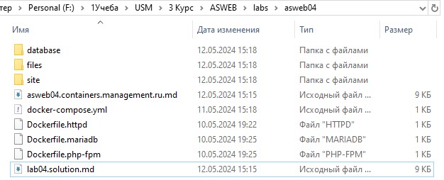
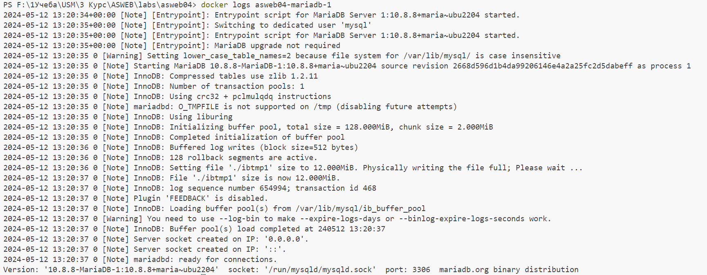
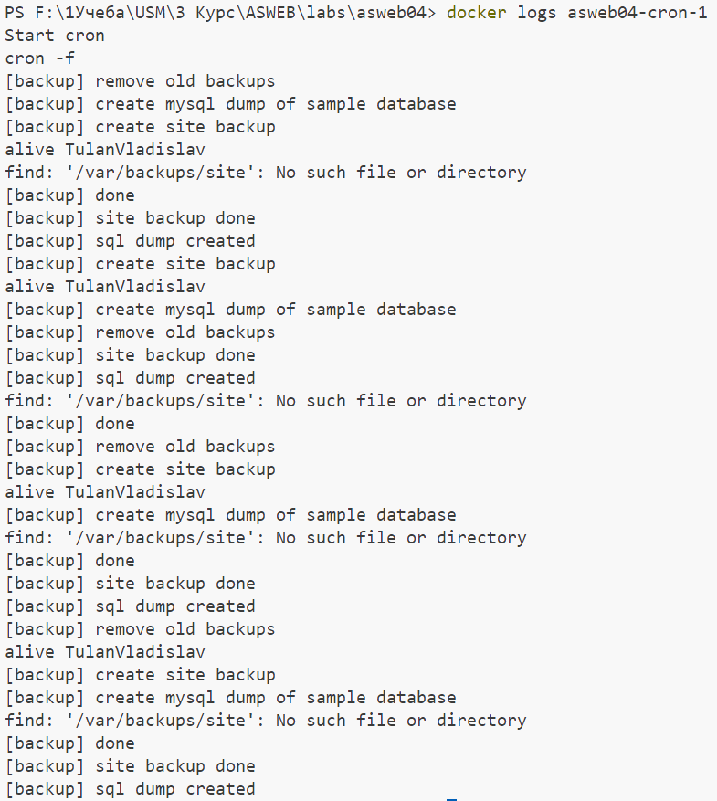
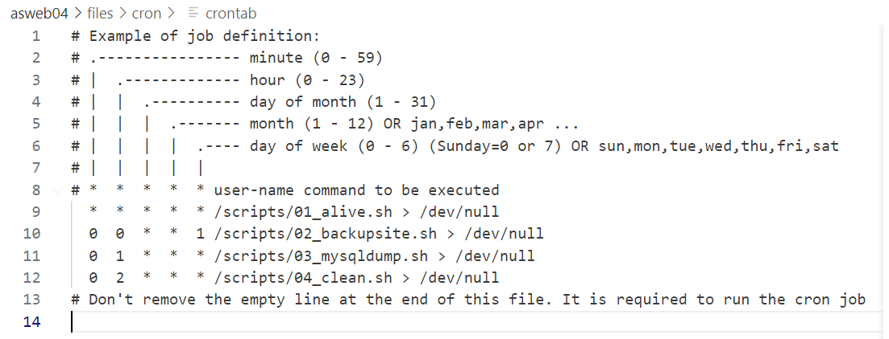

# Лабораторная работа № 4: Обслуживание сервера

Целью данной работы является обучение обслуживанию Web серверов, работающих в контейнерах.

> В производстве создание резервных копий часто выполняется специализированными средствами, в данной же работы рассматривается работа менеджера задач __cron__.

> Для облегчения сбора журналов стандартной практикой является переадресация логов в стандартные потоки __STDOUT__ и __STDERR__.

## Подготовка

Работа выполняется на базе результата Л.Р. №3.

Проверьте, что у вас установлен и запущен _Docker Desktop_.

Создайте папку `asweb04`. В ней будет выполняться вся работа.

Скопируйте в папку `asweb04` содержимое папки `asweb03`.



Лабораторная работа выполняется при подключении к сети Internet, так как скачиваются образы из репозитория https://hub.docker.com

## Выполнение

Для резервного копирования будем использовать контейнер _cron_, который:

1. каждые 24 часа создаёт резервную копию базы данных CMS;
2. каждый понедельник создаётся резервная копия директории CMS;
3. Каждые 24 часа удаляет резервные копии, которые были созданы 30 дней назад.
4. Каждую минуту в лог пишет сообщение _alive, \<username\>_.

Для этого в папке `./files/` создайте папку `cron`. В папке `./files/cron/` создайте папку `scripts`. В корневом каталоге создайте папку `backups`, а в ней `mysql`, `site`.


### сообщение о статусе

В папке `./files/cron/scripts/` создайте файл `01_alive.sh` со следующим содержимым:

```shell
#!/bin/sh

echo "alive ${USERNAME}" > /proc/1/fd/1
```


Данный скрипт выдает сообщение `alive ${USERNAME}`.

### резервное копирование сайта

В папке `./files/cron/scripts/` создайте файл `02_backupsite.sh` со следующим содержимым:

```shell
#!/bin/sh

echo "[backup] create site backup" \
    > /proc/1/fd/1 \
    2> /proc/1/fd/2
tar czfv /var/backups/site/www_$(date +\%Y\%m\%d).tar.gz /var/www/html
echo "[backup] site backup done" \
    >/proc/1/fd/1 \
    2> /proc/1/fd/2
```

Данный скрипт выдает архивирует папку `/var/www/html` и сохраняет архив в `/var/backups/site/`.

### резервное копирование базы данных

В папке `./files/cron/scripts/` создайте файл `03_mysqldump.sh` со следующим содержимым:

```shell
#!/bin/sh

echo "[backup] create mysql dump of ${MARIADB_DATABASE} database" \
    > /proc/1/fd/1
mysqldump -u ${MARIADB_USER} --password=${MARIADB_PASSWORD} -v -h mariadb ${MARIADB_DATABASE} \
    | gzip -c > /var/backups/mysql/${MARIADB_DATABASE}_$(date +\%F_\%T).sql.gz 2> /proc/1/fd/1
echo "[backup] sql dump created" \
    > /proc/1/fd/1
```

### удаление старых файлов

В папке `./files/cron/scripts/` создайте файл `04_clean.sh` со следующим содержимым:

```shell
#!/bin/sh

echo "[backup] remove old backups" \
    > /proc/1/fd/1 \
    2> /proc/1/fd/2
find /var/backups/mysql -type f -mtime +30 -delete \
    > /proc/1/fd/1 \
    2> /proc/1/fd/2
find /var/backups/site -type f -mtime +30 -delete \
    > /proc/1/fd/1 \
    2> /proc/1/fd/2
echo "[backup] done" \
    > /proc/1/fd/1 \
    2> /proc/1/fd/2
```

### подготовка cron

В папке `./files/cron/scripts/` создайте файл `environment.sh` со следующим содержимым:

```shell
#!/bin/sh

env >> /etc/environment

# execute CMD
echo "Start cron" >/proc/1/fd/1 2>/proc/1/fd/2
echo "$@"
exec "$@"
```

В папке `./files/cron/` создайте файл `crontab` со следующим содержимым:

```
# Example of job definition:
# .---------------- minute (0 - 59)
# |  .------------- hour (0 - 23)
# |  |  .---------- day of month (1 - 31)
# |  |  |  .------- month (1 - 12) OR jan,feb,mar,apr ...
# |  |  |  |  .---- day of week (0 - 6) (Sunday=0 or 7) OR sun,mon,tue,wed,thu,fri,sat
# |  |  |  |  |
# *  *  *  *  * user-name command to be executed
  *  *  *  *  * /scripts/01_alive.sh > /dev/null
  *  *  *  *  * /scripts/02_backupsite.sh > /dev/null
  *  *  *  *  * /scripts/03_mysqldump.sh > /dev/null
  *  *  *  *  * /scripts/04_clean.sh > /dev/null
# Don't remove the empty line at the end of this file. It is required to run the cron job
```

### создание контейнера cron

Создайте в корневом каталоге файл `Dockerfile.cron` со следующим содержимым:

```dockerfile
FROM debian:latest

RUN apt update && apt -y upgrade && apt install -y cron mariadb-client

COPY ./files/cron/crontab /etc/cron.d/crontab
COPY ./files/cron/scripts/ /scripts/

RUN crontab /etc/cron.d/crontab

ENTRYPOINT [ "/scripts/environment.sh" ]
CMD [ "cron", "-f" ]
```

Отредактируйте файл `docker-compose.yml`, добавив после определения сервиса `mariadb` следующие строки:

```yaml
  cron:
    build:
      context: ./
      dockerfile: Dockerfile.cron
    environment:
      USERNAME: <nume prenume>
      MARIADB_DATABASE: sample
      MARIADB_USER: sampleuser
      MARIADB_PASSWORD: samplepassword
    volumes:
      - "./backups/:/var/backups/"
      - "./site/wordpress/:/var/www/html/"
    networks:
      - internal
```

Замените `<nume prenume>` на ваши имя и фамилию.

### Ротация логов

Обратите внимание, что сборка сервера на основе контейнеров выводит логи не в файлы, а в стандартный поток вывода.

Проверьте, проанализировав файл `./files/httpd/httpd.conf`, куда выводится журнал общего назначения Apache HTTP Server? А журнал ошибок?

Конфигурация логов:


## Запуск и тестирование

Для построения проекта откройте командную строку и выполните в корневом каталоге команду

```shell
docker-compose build
```


Запустите решение командой

```shell
docker-compose up -d
```

Прочите логи каждого контейнера. Для этого выполните команду

```shell
docker logs <container name>
```






Например, для созданного контейнера _cron_ логи можно прочитать следующей командой:

```shell
docker logs asweb04-cron-1
```

Подождите 2-3 минуты и проверьте, что находится в папках `./backups/mysql/`  и `./backups/site/`.


Остановите контейнеры и исправьте файл `./files/cron/crontab` таким образом, чтобы

1. каждые день в 1:00 создавалась резервная копия базы данных CMS;
2. каждый понедельник создавалась резервная копия директории CMS;
3. Каждые день в 2:00 удалялись резервные копии, которые были созданы 30 дней назад.

Отредактированный файл `crontab`:


## Отчет

Предоставьте отчет о проделаной работе.

Ответьте на вопросы:

1. Зачем необходимо создавать пользователя системы для каждого сайта?
__Создание отдельного пользователя для каждого сайта обеспечивает изоляцию доступа между различными проектами, улучшает безопасность и управление правами доступа.__
2. В каких случаях Web сервер должен иметь полный доступ к папкам (папке) сайта?
__Полный доступ к папкам сайта необходим в случае, когда веб-серверу требуется чтение, запись и выполнение файлов, например, при обновлении файлов CMS, загрузке файлов на сервер или создании временных файлов.__
3. Что означает команда `chmod -R 0755 /home/www/anydir`?
__Команда chmod -R 0755 /home/www/anydir устанавливает права доступа на чтение, запись и выполнение для владельца папки и только чтение и выполнение для группы и остальных пользователей в рекурсивном режиме для папки /home/www/anydir.__
4. В скриптах shell каждая команда оканчивается строкой `> /proc/1/fd/1`. Что это означает?
__В скриптах shell каждая команда, завершившаяся строкой > /proc/1/fd/1, направляет стандартный вывод (stdout) в стандартный поток вывода init процесса (PID 1), который является родителем всех процессов в Linux. Это используется для вывода сообщений в стандартный вывод контейнера Docker, что облегчает отслеживание и анализ работы скриптов.__


## Вывод

В ходе выполнения лабораторной работы были изучены и применены навыки обслуживания веб-серверов, работающих в контейнерах. В рамках работы были реализованы задачи резервного копирования базы данных и файловой системы CMS с помощью менеджера задач cron.

Для выполнения задач резервного копирования были созданы скрипты shell, которые запускаются по расписанию с помощью cron. Скрипты выполняют следующие задачи:

1. 01_alive.sh: каждую минуту выводит сообщение о живучести с указанием имени пользователя.
2. 02_backupsite.sh: создает архив директории сайта и сохраняет его в соответствующую папку резервных копий.
3. 03_mysqldump.sh: создает дамп базы данных и сохраняет его в папку резервных копий.
4. 04_clean.sh: удаляет старые резервные копии.

Также был создан контейнер cron, который запускает задачи cron и выполняет описанные выше скрипты по расписанию.